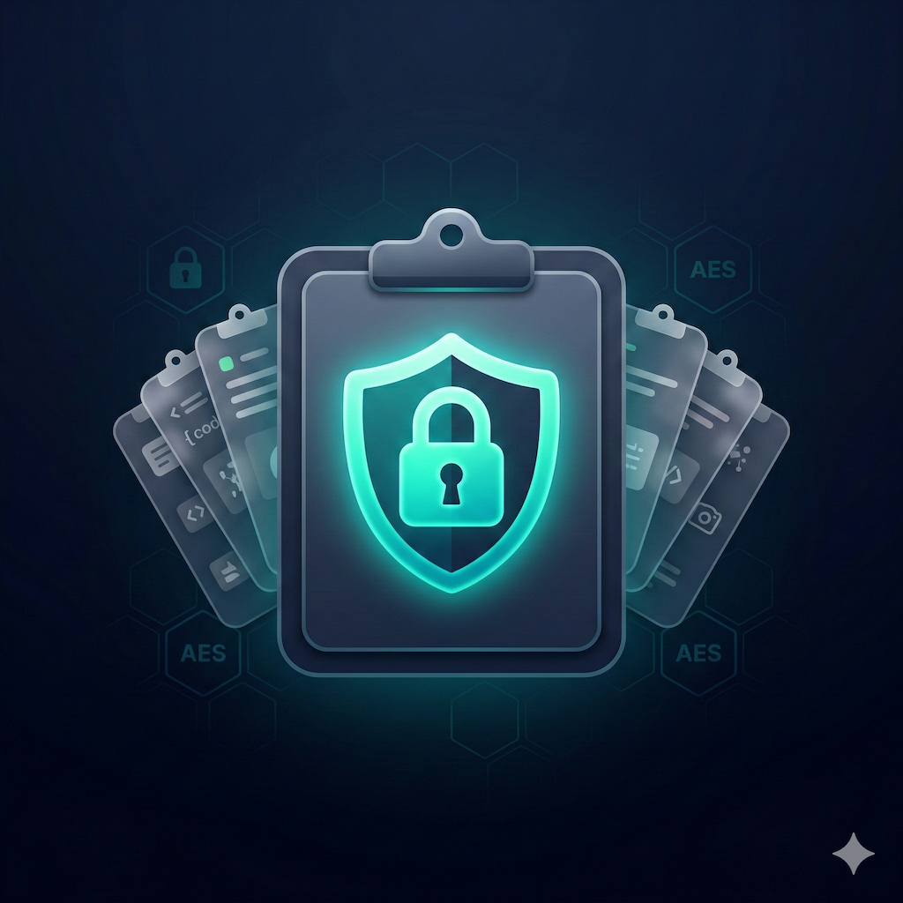

🌐 [English](README.md) | [Deutsch](README.de.md)

# ClipVault

[](https://developer.android.com)
[](https://developer.android.com/about/versions/10)
[](https://kotlinlang.org)
[](https://developer.android.com/jetpack/compose)
[](https://m3.material.io)
[](https://www.zetetic.net/sqlcipher/)
[](LICENSE)
[](https://github.com/pepperonas/clipvault/releases)

<p align="center">
  
</p>

Android clipboard history manager with always-on encryption and optional app lock.

## No INTERNET Permission

ClipVault works **completely offline**. The app has the INTERNET permission explicitly removed (`tools:node="remove"` in the manifest). No data is sent, no telemetry is collected, no servers are contacted. Your clipboard data never leaves your device.

## Features

- **Reliable clipboard capture** via AccessibilityService (listener + event polling + timer fallback, mutex-protected debouncing)
- **Persistent storage** in a local Room database
- **Always-on encryption** -- database always encrypted with SQLCipher (AES-256), auto-generated 64-character passphrase in Android KeyStore (StrongBox preferred)
- **Optional app lock** -- display manually lockable with fingerprint/face or custom password
- **Favorites accordion** -- pinned clips in a collapsible section at the top of the list
- **Swipe-to-delete** with undo -- delete clips with a swipe gesture (40% threshold to prevent accidental deletion), with undo option
- **Content type icons** -- automatic detection of social media links (Instagram, Facebook, YouTube, X, TikTok, LinkedIn, GitHub), URLs, emails, phone numbers
- **Built-in guide** -- help dialog directly in the app
- **Search** and clip management
- **Material You** (dynamic colors from Android 12) with dark/light support
- **Foreground service** with persistent notification
- **No clip limits** -- store unlimited clips

## Installation

### APK from GitHub

Signed APKs (release + debug) are available for download on the [Releases page](https://github.com/pepperonas/clipvault/releases).

**Important (Android 13+):** When installing via APK, Android blocks the Accessibility Service by default ("Restricted setting"). Here is how to enable it:

1. Open **Settings > Apps > ClipVault**
2. Tap the **three-dot menu** in the top right corner
3. Select **"Allow restricted settings"**
4. Then enable the Accessibility Service under **Accessibility > ClipVault**

> This step is only required once per installation and is not needed when installing from the Play Store.

### Prerequisites

- Android 10+ (API 29)
- AccessibilityService permission (for clipboard monitoring)
- Optional: Biometric hardware (for biometric app lock)

## Build

```bash
# Debug
./gradlew assembleDebug

# Release (minified + shrunk)
./gradlew assembleRelease

# Install on device
./gradlew installDebug

# Run tests
./gradlew test
```

## Architecture

```
io.celox.clipvault/
├── ClipVaultApp.kt                  # Application — always open DB encrypted
├── data/
│   ├── ClipEntry.kt                 # Room Entity
│   ├── ClipDao.kt                   # Room DAO
│   ├── ClipDatabase.kt              # Room DB (always SQLCipher-encrypted)
│   ├── ClipRepository.kt            # Repository (dedup, cooldown, mutex)
│   └── DatabaseMigrationHelper.kt   # Plain -> Encrypted Migration
├── security/
│   └── KeyStoreManager.kt           # Android KeyStore (StrongBox) + Auto-Passphrase + App-Lock
├── service/
│   ├── ClipAccessibilityService.kt  # Clipboard capture (3 strategies)
│   └── ClipVaultService.kt          # Foreground Service
└── ui/
    ├── theme/Theme.kt               # Material 3 Theme
    ├── history/
    │   ├── HistoryActivity.kt       # Main screen
    │   └── HistoryViewModel.kt      # ViewModel
    ├── settings/SettingsActivity.kt  # Settings (app lock, info)
    └── about/AboutActivity.kt       # About the app
```

### Security Architecture

The database is **always encrypted** -- there is no unencrypted mode:

- **DB passphrase**: 64 characters, randomly generated via `SecureRandom`, stored in Android KeyStore (AES-256-GCM)
- **StrongBox**: On devices with a dedicated Secure Element (e.g. Samsung S24), the KeyStore key is preferentially generated there
- **Byte zeroing**: Passphrase byte arrays are zeroed after use to minimize their time in RAM
- **App lock** (optional): UI-level only -- locks the display, not the database. Two modes:
  - *Fingerprint*: Auto-generated password, unlock only via biometrics/device PIN
  - *Custom password*: Manually set, optionally combinable with biometrics

### Data Flow

1. **Clipboard capture**: AccessibilityService (3 strategies, mutex debouncing) -> ClipRepository.insert() (mutex-serialized) -> encrypted Room DB
2. **UI**: HistoryViewModel <- Flow<List<ClipEntry>> <- ClipDao
3. **App lock**: HistoryActivity checks `isAppLockEnabled` -> BiometricPrompt or password dialog

### Migration from v1/v2

On the first launch after updating to v3, automatic migration is performed:

- **v1/v2 (encrypted with user password)**: Legacy password is adopted as DB passphrase, app lock is activated
- **v2 (unencrypted)**: Database is encrypted with an auto-generated passphrase
- **Fresh install**: Database is created encrypted from the start

## Versioning

This project uses [Semantic Versioning](https://semver.org/):

- **MAJOR**: Breaking changes (e.g. architecture overhaul)
- **MINOR**: New features (backward-compatible)
- **PATCH**: Bug fixes

| Version | Change |
|---|---|
| 3.6.0 | Full bilingual support (English + German), all hardcoded strings externalized to string resources |
| 3.5.0 | Open source (MIT license), in-app licensing removed (no more clip limits), unit tests added |
| 3.4.0 | Delete cooldown prevents re-insert by polling, toast spam removed, umlauts fixed, README badges |
| 3.3.1 | Fix: top entry deletable (swipe deletion after animation), shorter toasts, about page with developer info and website link |
| 3.3.0 | Content type icons (social media, URL, email, phone), 40% swipe threshold to prevent accidental deletion, fix: last entry deletable |
| 3.2.0 | Undo after delete, built-in guide, bug fixes (copy exception handling, swipe UX polish) |
| 3.1.1 | Clipboard capture: mutex debouncing, race condition fixes, retry on DB init, error handling |
| 3.1.0 | Favorites accordion, swipe-to-delete, persistent notification |
| 3.0.0 | Always-on encryption, app lock instead of optional DB encryption, StrongBox |
| 2.0.0 | Settings, licensing, optional encryption, about |
| 1.0.0 | Initial release |

## Tech Stack

| Component | Version |
|---|---|
| Kotlin | 2.0.21 |
| Jetpack Compose BOM | 2024.12.01 |
| Material 3 | via Compose BOM |
| Room | 2.6.1 |
| SQLCipher | 4.5.4 |
| AGP | 8.7.3 |
| Gradle | 8.11.1 |
| minSdk | 29 (Android 10) |
| targetSdk | 35 |

## Author

**Martin Pfeffer** -- [celox.io](https://celox.io)

## License

MIT License -- see [LICENSE](LICENSE).
